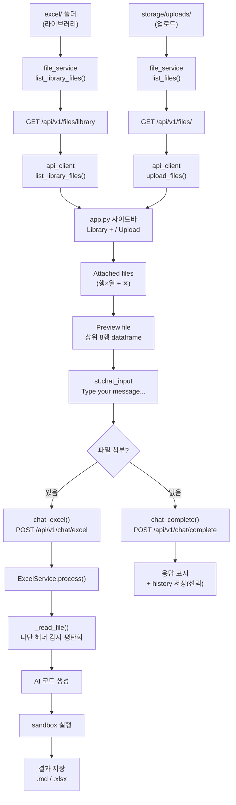
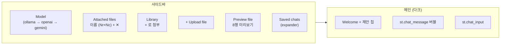

# Basic Software Technology

Streamlit 기반 대화형 excel 분석 SW


---

## 요약

| 구분 | 설명 |
|------|------|
| **메인 UI** | `frontend/app.py` — **Streamlit AI Lab** (다크 채팅 + 사이드바) |
| **보조 페이지** | `frontend/pages/` — Files / Models / Results (선택) |
| **백엔드** | FastAPI — 채팅, 파일, 모델, 대화 이력, (선택) 원격 실행 |
| **AI** | OpenAI · Gemini · Ollama (`AIRouter`가 모델명으로 자동 선택) |
| **엑셀** | 프롬프트 → AI가 pandas 코드 생성 → **샌드박스**에서만 실행 |
| **로컬 라이브러리** | `excel/` 폴더 — **읽기 전용**, UI **Library**에서 `+`로 첨부 |
| **결과** | `.md` / 가공 `.xlsx` → `storage/results/` |

---

## Pipeline

로컬 `excel/` 파일이든, 업로드한 파일이든 **같은 AI 처리 파이프**로 이어집니다.



> **참고:** `excel/`에 새 파일을 넣으면 백엔드 재시작 없이 Library 목록에 반영됩니다.

---

## UI 구성 (`frontend/app.py`)

메인 화면은 **단일 채팅 페이지**입니다. Files 페이지로 가지 않아도 사이드바에서 엑셀을 붙이고 분석할 수 있습니다.



| 영역 | 동작 |
|------|------|
| **Model** | `list_models()` — Ollama 모델 우선 정렬 |
| **Attached files** | 첨부된 파일만 표시, `✕`로 제거 |
| **Library** | `excel/` 파일, `+`로 첨부 (삭제 API 불가) |
| **Upload** | `upload_files()` → uploads 저장 후 첨부 |
| **Preview file** | 첨부 파일 중 선택 → `@st.cache_data`로 8행 표시 |
| **채팅** | 파일 없음 → 일반 채팅 / 파일 있음 → `chat_excel` |

### 보조 페이지 (`frontend/pages/`)

| 페이지 | 역할 |
|--------|------|
| **Files** | 업로드·라이브러리·AI Excel 템플릿 (기존 워크플로) |
| **Models** | provider 상태, Ollama pull/delete |
| **Results** | 저장된 `.md` / `.xlsx` 조회 |

---

## 라이브러리 vs 업로드

| 항목 | 라이브러리 (`excel/`) | 업로드 |
|------|----------------------|--------|
| 설정 | `EXCEL_LIBRARY_DIR` (`backend/core/config.py`) | `storage/uploads/` |
| API 목록 | `GET /api/v1/files/library` | `GET /api/v1/files/` |
| UI | Library `+` 버튼 | `+ Upload file` |
| 삭제 | 불가 (API `403`) | `DELETE /api/v1/files/{id}` |
| 미리보기 | `path=excel/파일명` | 업로드 바이트 또는 download URL |

---

## AI 모델 연결

| 모델 이름 예시 | Provider |
|----------------|----------|
| `gpt-4o`, `gpt-4o-mini`, `o1-*` | OpenAI |
| `gemini-*` | Google Gemini |
| `llama3`, `llama3.1:*`, `qwen*` 등 | Ollama |

`.env` 예시:

```env
OPENAI_API_KEY=sk-...
GEMINI_API_KEY=AIza...
OLLAMA_BASE_URL=http://localhost:11434
OLLAMA_DEFAULT_MODEL=llama3
```

**실행 순서:** 백엔드(8000) → Streamlit(8501). 백엔드 없으면 채팅·파일 API가 실패합니다.

---

## 빠른 실행

```bash
cd ai-prompt-platform
cp .env.example .env   # API 키 등 입력
pip install -r requirements/dev.txt
bash scripts/start_dev.sh
```

**Windows (PowerShell):**

```powershell
cd C:\Users\keti\eunbi\ai-prompt-platform
$env:PYTHONPATH = "."
.\.venv\Scripts\python.exe -m pip install -r requirements\dev.txt
# 터미널 1
.\.venv\Scripts\python.exe -m uvicorn backend.main:app --reload --port 8000
# 터미널 2
.\.venv\Scripts\python.exe -m streamlit run frontend\app.py
```

| 접속 | URL |
|------|-----|
| **Streamlit (메인)** | http://localhost:8501 |
| API 문서 | http://localhost:8000/api/v1/docs |

> UI가 안 바뀌면 **8501 루트 `/`** 인지 확인하고, Streamlit을 `Ctrl+C` 후 위 명령으로 다시 실행하세요.

---

## 프로젝트 구조

```
ai-prompt-platform/
├── backend/                 # FastAPI
│   ├── main.py
│   ├── api/routes/          # chat, files, models, history, execution
│   └── services/            # ai/, excel_service, file_service, sandbox, …
├── frontend/
│   ├── app.py               # Streamlit AI Lab (메인)
│   ├── pages/               # Files, Models, Results
│   └── utils/api_client.py  # 백엔드 HTTP 단일 진입점
├── excel/                   # 로컬 라이브러리 (Git 제외 권장)
├── storage/uploads/         # 업로드 (Git 제외)
├── storage/results/         # markdown/, excel/
├── chat_history/            # 저장된 대화 JSON (Git 제외)
├── docker/
├── scripts/
├── tests/
├── config/settings.yaml
├── requirements/
└── .env.example
```

---

## 테스트

```bash
pip install -r requirements/dev.txt
pytest tests/ -v
```

---

## Git 커밋 / 푸시

`excel/`, `.venv/`, `storage/uploads/`, `storage/results/`, `chat_history/` 등은 **`.gitignore`** 로 원격에 올리지 않습니다.

```powershell
cd C:\Users\keti\eunbi\ai-prompt-platform
git add README.md frontend/app.py
git commit -m "docs: update README for Streamlit AI Lab UI"
git pull origin main --no-rebase   # 원격이 앞서 있으면
git push origin main
```

원격: https://github.com/eunbijoel/SW_Tech
