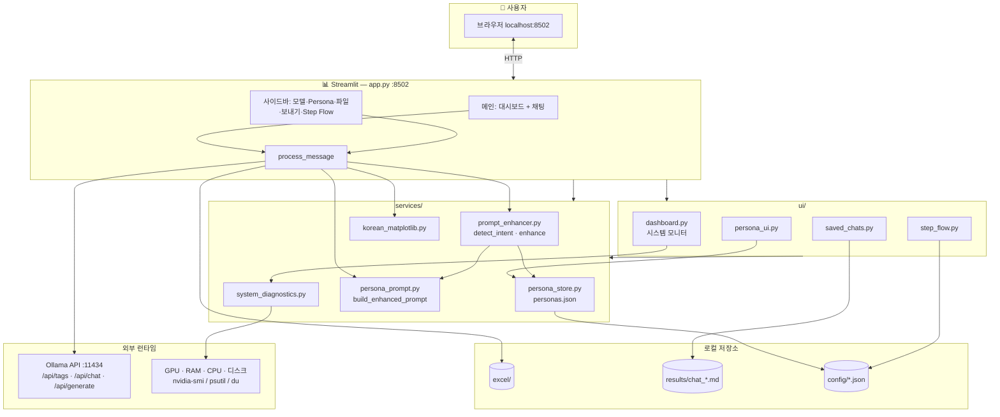
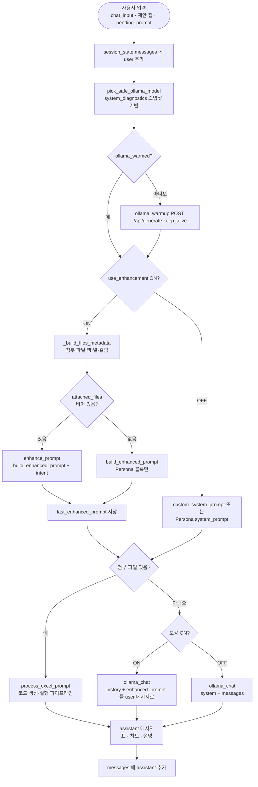

# Basic SW Technology

Streamlit 기반 AI 엑셀 분석 도구 — Ollama 로컬 모델을 활용한 자연어 엑셀 처리·분석·병합·보내기

---


## 주요 기능

### 1. 시스템 모니터


- GPU / RAM / CPU / 디스크 탭 
- 우측 요약: GPU 제조사, Server, **선택 중인 Ollama 모델** · 연결 상태
- 프로젝트 폴더 용량은 전체 디스크와 별도 표시 (착각 방지)

### 2. Excel · 파일


- 다중 Excel/CSV 업로드 → `./excel/` 저장
- 파일 목록 (➕ 첨부 / 🗑 삭제)
- 첨부 파일 목록
- 시트 미리보기 (상위 8행)

### 3. AI 채팅 & 엑셀 처리

- ChatGPT 스타일 대화 UI
- Ollama 로컬 연결, 다중 모델 선택
- **파일 첨부 시:** pandas 코드 생성 → 샌드박스 실행 → 표·차트
- **파일 없을 때:** Persona 결합 **enhanced prompt** 로 일반 채팅
- FILE_META: 파일별 범위만 (의도치 않은 `pd.concat` 방지)
- 제안으로 빠른 시작

### 4. Persona & 프롬프트 보강


- **5종 내장 Persona** + 사용자 추가 (`config/personas.json`)
- 사이드바 `> 🎭 페르소나`: 선택 · name/description/system_prompt/response_style/tools 편집 · Save
- 기본 Persona는 삭제 불가, 수정 내용은 JSON에 영구 저장
- **프롬프트 보강 ON** 시 `[Persona]` + `[System Instruction]` + `[User Request]` 형태로 결합
- 채팅 후 **강화된 Prompt 미리보기** (expander 1곳)
- 대형 모델(gemma4:31b 등): GPU VRAM 기준 적합 여부 안내


| 페르소나         | 전문 분야            |
| ------------ | ---------------- |
| 📊 데이터 분석가   | 통계, 패턴, 트렌드 해석   |
| 📋 엑셀 전문가    | 수식, 데이터 정제, 셀 연산 |
| 💼 비즈니스 컨설턴트 | KPI, 경영 인사이트     |
| 🔬 연구원       | 방법론, 정확성, 상세 보고서 |
| 🎯 일반 어시스턴트  | 균형 잡힌 범용 지원      |


### 5. 저장된 대화 & Step Flow


- `results/chat_*.md` 대화 저장 · 사이드바 목록 · 불러오기
- **Step Flow / Skill:** STEP 1→2→3 에 저장 대화 연결 (`config/chat_step_links.json`)
- Step별 selectbox, flowchart, ▶ Flow 실행 (준비 중 — UI만)

### 6.보내기

- 분석 결과 Excel 다운로드
- 대화 `.md` 저장
- 차트 PNG 다운로드

### 7. 보안

- AST 기반 코드 검증
- 서브프로세스 샌드박스 (60초 타임아웃)
- 위험 모듈/함수 차단

---

## 사이드바


| 순서  | 영역                   | 설명                       |
| --- | -------------------- | ------------------------ |
| 1   | 모델 선택                | Ollama 모델 + GPU VRAM 안내  |
| 2   | ✏️ 새 대화              | 세션 초기화                   |
| 3   | `> 🎭 페르소나`          | JSON 편집·저장               |
| 4   | `> ⚙️ 고급 · 엑셀 분석`    | 보강 ON/OFF, 빠른 모드, GPU 예열 |
| 5   | `> 📁 Excel · 파일`    | 업로드·목록·첨부·미리보기           |
| 6   | 💾보내기                | 대화 저장 / Excel / 차트       |
| 7   | 📜 저장된 대화            | Step 필터 + 목록             |
| 8   | 🔗 Step Flow / Skill | 3단계 워크플로 구성              |
| 9   | ✨ 강화 Prompt 미리보기     | 마지막 채팅 실행 후              |
| 10  | ⚙️ 설정 · 환경           | GPU 타깃, 환경 변수            |


---

## 파이프라인
[전체 아키텍처]


[사용자 메시지 처리 과정]

---

## Claude Code / Codex Skill Mapping


| Skill                  | 프로젝트 적용                        | 코드 위치                                                                                    |
| ---------------------- | ------------------------------ | ---------------------------------------------------------------------------------------- |
| **File I/O**           | Excel 업로드·읽기·쓰기                | `app.py`                                                                                 |
| **Code Generation**    | 자연어 → pandas                   | `app.py` — `generate_code_prompt()`                                                      |
| **Data Analysis**      | 병합·계산·FILE_META                | `app.py` — `process_excel_prompt()`                                                      |
| **Conversation**       | 채팅 UI                          | `app.py` — `process_message()`, `ollama_chat()`                                          |
| **Prompt Engineering** | Persona JSON + enhanced prompt | `services/persona_prompt.py`, `services/prompt_enhancer.py`, `services/persona_store.py` |
| **Monitoring**         | GPU/RAM/디스크/Ollama             | `services/system_diagnostics.py`, `ui/dashboard.py`                                      |
| **Workflow**           | Step Flow UI                   | `ui/step_flow.py`, `ui/saved_chats.py`                                                   |
| **Security**           | AST 검증·샌드박스                    | `app.py` — `execute_pandas_code()`                                                       |


---

## 설치 및 실행

```bash
cd SW_Tech
python3 -m venv .venv
source .venv/bin/activate   # Windows: .venv\Scripts\activate

pip install -r requirements.txt

# 실행
streamlit run app.py --server.port 8502
```

최초 실행 시 `config/personas.json` 이 없으면 **내장 5종 Persona** 로 자동 생성

---

## 활용 방법

1. **파일:** 사이드바 `> 📁 Excel · 파일` 에서 업로드 후 ➕ 첨부
2. **Persona:** `> 🎭 페르소나` 에서 선택·필요 시 Save
3. **모델:** 사이드바 상단에서 Ollama 모델 선택
4. **채팅:** 요청 입력 (보강 ON이면 Persona가 프롬프트에 합쳐짐)
5. **결과:** 표·차트 확인 후 💾보내기
6. **이어하기:** 대화 저장 → 📜 / Step Flow 에서 STEP별 불러오기

### 예시 프롬프트

```
첨부된 모든 엑셀 파일을 하나로 병합하고, 중복 컬럼은 평균값으로 처리해주세요.
계획예산 대비 집행계의 집행률(%)을 계산해주세요.
각 파일별 데이터가 채워진 행과 열의 범위를 알려주세요.
df_0, df_1, df_2에 각각 출처 컬럼을 추가해 pd.concat으로 통합하세요.
```

---

## 프로젝트 구조

```
SW_Tech/
├── app.py                          # 메인 Streamlit 앱 (8502)
├── scripts/
│   └── run_studio.sh               # 실행 스크립트
├── ui/
│   ├── dashboard.py                # 시스템 모니터·상단 대시보드
│   ├── persona_ui.py               # Persona 선택/편집 UI
│   ├── saved_chats.py              # 저장된 대화 + Step 필터
│   └── step_flow.py                # Step Flow / Skill UI
├── services/
│   ├── persona_service.py          # 내장 5종 Persona 정의
│   ├── persona_store.py            # personas.json 로드/저장
│   ├── persona_prompt.py           # build_enhanced_prompt()
│   ├── prompt_enhancer.py          # 의도 감지 + 엑셀 경로 보강
│   ├── system_diagnostics.py       # GPU/RAM/CPU/디스크/Ollama
│   └── korean_matplotlib.py        # 한글 차트 폰트
├── config/
│   ├── personas.json               # Persona 저장 (편집 반영)
│   ├── flow_templates.json         # Step Flow 템플릿
│   ├── chat_step_links.json        # 저장 대화 ↔ Step 매핑
│   └── custom_personas.json        # (레거시, 최초 마이그레이션용)
├── excel/                          # 업로드 Excel
├── results/                        # chat_*.md 대화 기록
├── tests/unit/
├── requirements.txt
└── README.md
```

---

## 환경 변수


| 변수                  | 기본값                      | 설명         |
| ------------------- | ------------------------ | ---------- |
| `OLLAMA_BASE_URL`   | `http://localhost:11434` | Ollama API |
| `OLLAMA_KEEP_ALIVE` | `30m`                    | 모델 메모리 유지  |


---

## 변경 이력 (요약)

- **2026-05-22:** Persona `personas.json` 저장·enhanced prompt 파이프라인, 시스템 모니터 UI, Step Flow/저장 대화, 사이드바 접이식 정리, GPU 기반 대형 모델 안내

