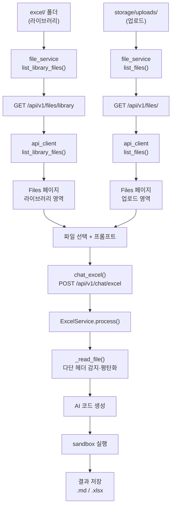
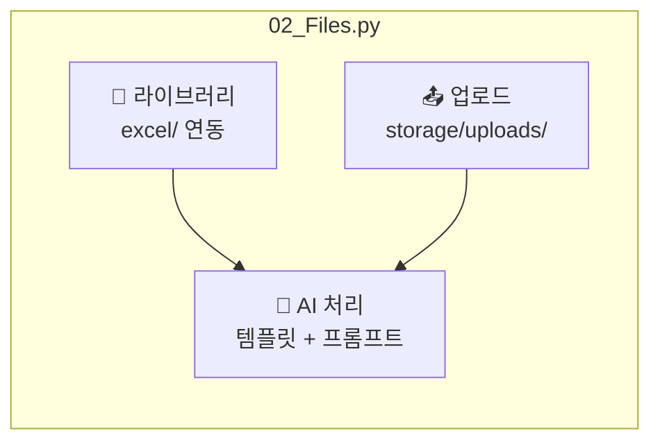

# Basic Software Technology

**Streamlit 기반 대화형 excel 분석 SW
---

## 요약


| 구분           | 설명                                           |
| ------------ | -------------------------------------------- |
| **프론트**      | Streamlit — Chat / Files / Models / Results  |
| **백엔드**      | FastAPI — 채팅, 파일, 모델, (선택) 원격 실행             |
| **AI**       | OpenAI · Gemini · Ollama                     |
| **엑셀**       | 프롬프트 → AI가 pandas 코드 생성 → **샌드박스**에서만 실행     |
| **로컬 라이브러리** | `excel/` 폴더 — **읽기 전용**, UI에 자동 표시 (삭제 불가)   |
| **결과**       | `.md` / 가공 `.xlsx` 를 `storage/results/` 에 저장 |


---

## Pipeline

로컬 `excel/` 파일이든, 업로드한 파일이든 **같은 AI 처리 파이프**로 이어집니다.




---

## Files 페이지 구성




| 영역    | 데이터 위치                             | 삭제             |
| ----- | ---------------------------------- | -------------- |
| 라이브러리 | `excel/` (설정: `EXCEL_LIBRARY_DIR`) | 불가 (API `403`) |
| 업로드   | `storage/uploads/`                 | 가능             |
| AI 처리 | 선택한 파일 ID로 `chat_excel` 호출         | —              |


---

## 라이브러리 vs 업로드


| 항목     | 라이브러리 (`excel/`)                               | 업로드                         |
| ------ | ---------------------------------------------- | --------------------------- |
| 설정     | `backend/core/config.py` → `EXCEL_LIBRARY_DIR` | `uploads` 경로                |
| API 목록 | `GET /api/v1/files/library`                    | `GET /api/v1/files/`        |
| 메타     | `FileRecord.library = true`, 파일명 기반 안정 UUID    | 기존 UUID + JSON 메타           |
| 경로 조회  | `get_path()` 가 업로드 + 라이브러리 모두 탐색               | 업로드만                        |
| 삭제     | 지원 안 함                                         | `DELETE /api/v1/files/{id}` |


---

## 빠른 실행

```bash
cd ai-prompt-platform
cp .env.example .env   # API 키 등 입력
pip install -r requirements/dev.txt
bash scripts/start_dev.sh
```


| 접속        | URL                                                                    |
| --------- | ---------------------------------------------------------------------- |
| Streamlit | [http://localhost:8501](http://localhost:8501)                         |
| API 문서    | [http://localhost:8000/api/v1/docs](http://localhost:8000/api/v1/docs) |


개별 실행:

```bash
uvicorn backend.main:app --reload --port 8000
streamlit run frontend/app.py
```

---

## 프로젝트 구조

```
ai-prompt-platform/
├── backend/           # FastAPI — main.py, api/routes/, services/, core/config.py
├── frontend/          # Streamlit — app.py, pages/, utils/api_client.py
├── excel/             # 로컬 라이브러리 (읽기 전용)
├── storage/uploads/   # 사용자 업로드
├── storage/results/   # markdown/, excel/
├── docker/
├── scripts/
├── tests/
├── config/settings.yaml
├── requirements/
└── .env.example
```

---

## 테스트

```bash
pip install -r requirements/dev.txt
pytest tests/ -v
```

---

## Git 커밋 / 푸시

`excel/`, `.venv/`, `storage/uploads/`, `storage/results/` 등은 **`.gitignore`** 로 원격에 올라가지 않습니다.

PowerShell에서 저장소 루트로 이동한 뒤:

```powershell
.\scripts\git_commit_and_push.ps1
```

원격이 없으면 `https://github.com/eunbijoel/SW_Tech.git` 가 `origin` 으로 추가됩니다. GitHub 로그인·토큰은 본인 환경에서 한 번 맞춰야 합니다.

