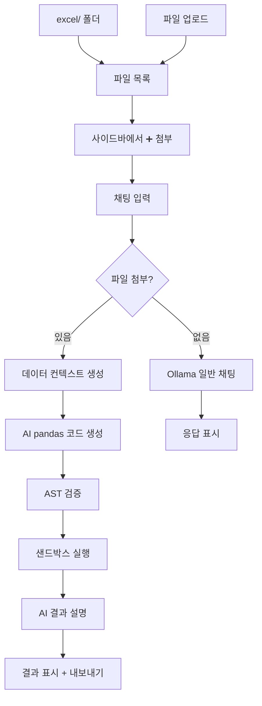

#Basic SW Technology
Streamlit 기반 AI 엑셀 분석 도구 — Ollama 로컬 모델을 활용한 자연어 엑셀 처리·분석·병합·내보내기

---

## 주요 기능


### 1. 파일 관리

- 다중 Excel/CSV 파일 업로드 (`./excel/` 폴더에 저장)
- 파일 목록 표시 (파일명, 크기, 날짜)
- 개별 파일 삭제
- 사이드바에서 파일 미리보기 (상위 8행)

### 2. AI 프롬프트 인터페이스

- ChatGPT 스타일 대화형 UI
- Ollama 로컬 서버 연결 (`http://localhost:11434`)
- 다중 모델 지원 (qwen3-coder:30b, deepseek-coder-v2, qwen2.5:7b 등)
- 모델 선택 드롭다운
- 제안 칩 버튼으로 빠른 시작

### 3. 자연어 엑셀 처리

- **파일 병합**: 다중 엑셀 파일을 하나로 병합, 중복 컬럼 평균 처리
- **데이터 범위**: 시트별 채워진 행/열 범위 분석
- **계산·변환**: 집행률, 잔액 순위, 비용 분류 등 자연어 계산
- **다단 헤더**: 한국어 예산 테이블의 병합 셀·다단 헤더 자동 감지
- **코드 생성**: AI가 pandas 코드를 생성하고 샌드박스에서 안전하게 실행

### 4. 결과 내보내기

- 분석 결과를 새 Excel 파일로 다운로드
- 대화 기록을 `.md` 파일로 저장
- UI 내 다운로드 버튼

### 5. 보안

- AST 기반 정적 분석으로 위험 코드 차단
- 서브프로세스 샌드박스 실행 (60초 타임아웃)
- 금지 모듈/함수 사전 필터링 (os, sys, subprocess 등)

### 6. 페르소나 & 프롬프트 보강

- 5종 AI 페르소나 선택 (사이드바 드롭다운)
- 자동 의도 감지 (MERGE, ANALYSIS, COMPARISON, SUMMARY, FILTER, CHART)
- 페르소나별 시스템 프롬프트 + 작업 힌트 자동 적용
- 시스템 프롬프트 직접 편집 가능
- 보강 ON/OFF 토글


| 페르소나         | 전문 분야              |
| ------------ | ------------------ |
| 📊 데이터 분석가   | 통계, 패턴, 트렌드 해석     |
| 📋 엑셀 전문가    | 수식, 데이터 정제, 셀 연산   |
| 💼 비즈니스 컨설턴트 | KPI, 경영 인사이트, 의사결정 |
| 🔬 연구원       | 방법론, 정확성, 상세 보고서   |
| 🎯 일반 어시스턴트  | 균형잡힌 범용 지원         |


---

## 파이프라인




---

## Claude Code / Codex Skill Mapping


| Claude Code Skill      | 프로젝트 적용             | 코드 위치                                                                        |
| ---------------------- | ------------------- | ---------------------------------------------------------------------------- |
| **File I/O**           | Excel 업로드, 읽기, 쓰기   | `app.py` — `list_excel_files()`, `read_excel_smart()`, `save_result_excel()` |
| **Code Generation**    | 자연어 → pandas 코드 생성  | `app.py` — `generate_code_prompt()`, `extract_code_block()`                  |
| **Data Analysis**      | 요약, 병합, 계산, 집행률 분석  | `app.py` — `process_excel_prompt()`, `execute_pandas_code()`                 |
| **Conversation**       | ChatGPT 스타일 대화 UI   | `app.py` — `process_message()`, `ollama_chat()`                              |
| **Prompt Engineering** | 페르소나 + 의도 감지 + 보강   | `persona_service.py`, `prompt_enhancer.py`                                   |
| **Security/Sandbox**   | AST 코드 검증, 격리 실행    | `app.py` — `_validate_code()`, `execute_pandas_code()`                       |
| **Export**             | Excel/Markdown 내보내기 | `app.py` — `save_result_excel()`, `save_conversation_md()`                   |


---

## 기술 스택


| 구분        | 기술                                    |
| --------- | ------------------------------------- |
| **프론트엔드** | Streamlit                             |
| **AI**    | Ollama (로컬, `http://localhost:11434`) |
| **엑셀 처리** | pandas, openpyxl, xlrd                |
| **내보내기**  | openpyxl (Excel), 내장 Markdown         |
| **코드 실행** | subprocess 샌드박스 + AST 검증              |


---

## 빠른 시작

### 사전 요구사항

1. Python 3.10+
2. [Ollama](https://ollama.ai/) 설치 및 실행
3. 모델 다운로드:

```bash
ollama pull qwen2.5:7b
# 또는
ollama pull deepseek-coder-v2
ollama pull qwen3-coder:30b
```

### 설치 및 실행

```bash
# 의존성 설치
pip install -r requirements.txt

# Ollama 서버 실행 (별도 터미널)
ollama serve

# 앱 실행
streamlit run app.py
```

### 접속


| 서비스                       | URL                                              |
| ------------------------- | ------------------------------------------------ |
| **AI Excel Agent Studio** | [http://localhost:8501](http://localhost:8501)   |
| Ollama API                | [http://localhost:11434](http://localhost:11434) |


---

## 사용 방법

1. **파일 준비**: `./excel/` 폴더에 분석할 Excel 파일을 넣거나, 사이드바에서 업로드
2. **파일 첨부**: 파일 목록에서 분석할 파일을 첨부
3. **모델 선택**: 사이드바에서 Ollama 모델 선택
4. **자연어 입력**: 채팅창에 분석 요청 입력
5. **결과 확인**: AI가 생성한 코드와 실행 결과 확인
6. **내보내기**: 결과를 Excel 또는 Markdown으로 저장

### 예시 프롬프트

```
첨부된 모든 엑셀 파일을 하나로 병합하고, 중복 컬럼은 평균값으로 처리해주세요.
계획예산 대비 집행계의 집행률(%)을 계산해주세요.
각 파일별 데이터가 채워진 행과 열의 범위를 알려주세요.
예산잔액이 가장 큰 상위 5개 항목을 추출해주세요.
```

---

## 프로젝트 구조

```
SW_Tech/
├── app.py                              # AI Excel Agent Studio 메인 앱
├── services/
│   ├── persona_service.py              # 5종 AI 페르소나 정의
│   ├── prompt_enhancer.py              # 의도 감지 + 프롬프트 보강
│   └── korean_matplotlib.py            # 한글 차트 폰트 설정
├── tests/
│   └── unit/
│       ├── test_persona_service.py     # 페르소나 테스트
│       └── test_prompt_enhancer.py     # 프롬프트 보강 테스트
├── excel/                              # Excel 파일 저장소
├── results/                            # 분석 결과 저장
├── requirements.txt                    # Python 의존성
└── README.md
```