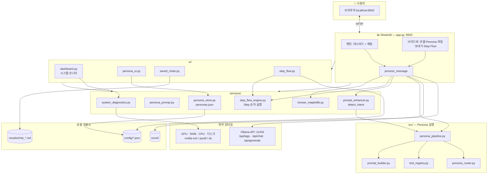
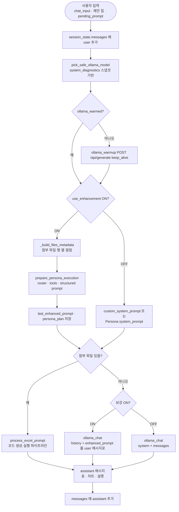

# Basic SW Technology

Streamlit 기반 AI 엑셀 분석 도구 — Ollama 로컬 모델을 활용한 자연어 엑셀 처리·분석·병합·보내기

---

## 주요 기능

### 1. 시스템 모니터

- GPU / RAM / CPU / 디스크 탭 
- 우측 요약: GPU 제조사, Server, **선택 중인 Ollama 모델** · 연결 상태
- 프로젝트 폴더 용량은 전체 디스크와 별도 표시 (착각 방지)

### 2. Excel · 파일

- 다중 Excel/CSV 업로드 → `./excel/` 저장
- 파일 목록 (➕ 첨부 / 🗑 삭제)
- 첨부 파일 목록
- 시트 미리보기 (상위 8행)

### 3. AI 채팅 & 엑셀 처리

- ChatGPT 스타일 대화 UI
- Ollama 로컬 연결, 다중 모델 선택
- **파일 첨부 시:** pandas 코드 생성 → 샌드박스 실행 → 표·차트
- **파일 없을 때:** Persona 결합 **enhanced prompt** 로 일반 채팅
- FILE_META: 파일별 범위만 (의도치 않은 `pd.concat` 방지)
- 제안으로 빠른 시작

### 4. Persona 맞춤 분석 실행

Persona는 말투만 바꾸지 않고 **분석 관점 · 도구 선택 · 출력 섹션**을 결정합니다.

**실행 흐름**

```text
user_prompt
  → selected_persona (config/personas.json)
  → 파일 메타 + DataFrame 로드
  → persona_router: 의도·Persona별 도구·실행 경로 결정
  → tool_registry: excel_analyzer 등 실제 실행
  → prompt_builder: system/user 섹션 분리·tool 결과 주입
  → model_router / app: LLM 코드 생성 또는 도구 전용 마크다운 응답
  → response_template 형식으로 출력
```

**실행 경로 (`execution_path`)**

| 경로 | 설명 |
|------|------|
| `tool_response` | 도구 결과만으로 응답 (예: 엑셀 전문가 + 파일 범위 질의) |
| `template_code` | 검증된 pandas 템플릿 (집행률 표·파일별 범위) |
| `llm_codegen` | Persona·도구 컨텍스트를 반영한 LLM 코드 생성 |

**코드 구조 (`src/`)**

| 파일 | 역할 |
|------|------|
| `persona_manager.py` | personas.json 로드·프로필 보강 |
| `persona_router.py` | 분석 전략·도구·경로 결정 |
| `tool_registry.py` | 도구 이름 ↔ 함수 매핑 |
| `excel_analyzer.py` | used range·시트 구조 실측 |
| `excel_actions.py` | 정제·후속 단계 제안 |
| `prompt_builder.py` | 구조화 프롬프트 (단순 문자열 붙이기 아님) |
| `model_router.py` | 템플릿 포맷·LLM 호출 래퍼 |
| `persona_pipeline.py` | 위 단계 오케스트레이션 |

**personas.json 확장 필드:** `analysis_focus`, `response_template`, `style_rules`, `tools` (실행 도구명)

- **5종 내장 Persona** + 사용자 추가 · 사이드바 `> 🎭 페르소나` 편집·Save
- 기본 Persona 삭제 불가 · **프롬프트 보강 ON** 시 구조화 미리보기 (expander)
- 대형 모델: GPU VRAM 기준 안내


| 페르소나         | 전문 분야            |
| ------------ | ---------------- |
| 📊 데이터 분석가   | 통계, 패턴, 트렌드 해석   |
| 📋 엑셀 전문가    | 수식, 데이터 정제, 셀 연산 |
| 💼 비즈니스 컨설턴트 | KPI, 경영 인사이트     |
| 🔬 연구원       | 방법론, 정확성, 상세 보고서 |
| 🎯 일반 어시스턴트  | 균형 잡힌 범용 지원      |


### 5. 저장된 대화 & Step Flow

- `results/chat_*.md` 대화 자동·수동 저장 (런타임 데이터 — `.gitignore` 제외)
- 사이드바 **📜 저장된 대화**: 요약 제목 · 불러오기 · 다운로드 · 삭제
- **Step Flow / Skill:** STEP 1→2→3에 저장 대화를 연결해 **순차 실행**
  - **▶ Flow 실행**: Step 1부터 `process_message` 파이프라인으로 실행
  - **▶ Step N 실행**: 이전 Step 결과를 프롬프트에 주입 후 다음 Step 진행
  - **데이터 흐름 추적**: 사용 파일·컬럼·연산·출력 shape (`services/step_flow_engine.py`)
- Flow 템플릿: `config/flow_templates.json` · Step↔대화 매핑 샘플: `config/chat_step_links.json`

### 6.보내기

- 분석 결과 Excel 다운로드
- 대화 `.md` 저장
- 차트 PNG 다운로드

### 7. 보안

- AST 기반 코드 검증
- 서브프로세스 샌드박스 (60초 타임아웃)
- 위험 모듈/함수 차단

---

## 사이드바


| 순서  | 영역                   | 설명                       |
| --- | -------------------- | ------------------------ |
| 1   | 모델 선택                | Ollama 모델 + GPU VRAM 안내  |
| 2   | ✏️ 새 대화              | 세션 초기화                   |
| 3   | `> 🎭 페르소나`          | JSON 편집·저장               |
| 4   | `> ⚙️ 고급 · 엑셀 분석`    | 보강 ON/OFF, 빠른 모드, GPU 예열 |
| 5   | `> 📁 Excel · 파일`    | 업로드·목록·첨부·미리보기           |
| 6   | 💾보내기                | 대화 저장 / Excel / 차트       |
| 7   | 📜 저장된 대화            | Step 필터 + 목록             |
| 8   | 🔗 Step Flow / Skill | 3단계 워크플로 구성              |
| 9   | ✨ 강화 Prompt 미리보기     | 마지막 채팅 실행 후              |
| 10  | ⚙️ 설정 · 환경           | GPU 타깃, 환경 변수            |


---

## 파이프라인

아래 다이어그램은 **8502 포트** `app.py` 기준 전체 워크플로입니다. (`studio/` 8503 앱은 별도 저장소·실행)

### 1. 전체 아키텍처




### 2. 사용자 메시지 처리 (`process_message`)




### 8. Ollama 호출 요약


| 경로                    | 함수                | API             | 옵션 프로필                |
| --------------------- | ----------------- | --------------- | --------------------- |
| 일반 채팅                 | `ollama_chat`     | `/api/chat`     | `OLLAMA_OPTS_CHAT`    |
| pandas 코드 생성          | `ollama_generate` | `/api/generate` | `OLLAMA_OPTS_CODE`    |
| 결과 설명 (fast_mode OFF) | `ollama_generate` | `/api/generate` | `OLLAMA_OPTS_EXPLAIN` |
| 모델 예열                 | `ollama_warmup`   | `/api/generate` | `keep_alive`          |


환경 변수: `OLLAMA_BASE_URL` (기본 `http://localhost:11434`), `OLLAMA_KEEP_ALIVE` (기본 `30m`).

---

## Claude Code / Codex Skill Mapping


| Skill                  | 프로젝트 적용                        | 코드 위치                                                                                    |
| ---------------------- | ------------------------------ | ---------------------------------------------------------------------------------------- |
| **File I/O**           | Excel 업로드·읽기·쓰기                | `app.py`                                                                                 |
| **Code Generation**    | 자연어 → pandas                   | `app.py` — `generate_code_prompt()`                                                      |
| **Data Analysis**      | 병합·계산·FILE_META                | `app.py` — `process_excel_prompt()`                                                      |
| **Conversation**       | 채팅 UI                          | `app.py` — `process_message()`, `ollama_chat()`                                          |
| **Prompt Engineering** | Persona 맞춤 분석·구조화 프롬프트      | `src/persona_pipeline.py`, `src/prompt_builder.py`, `services/prompt_enhancer.py`         |
| **Monitoring**         | GPU/RAM/디스크/Ollama             | `services/system_diagnostics.py`, `ui/dashboard.py`                                      |
| **Workflow**           | Step Flow 순차 실행              | `services/step_flow_engine.py`, `ui/step_flow.py`, `app.py` `handle_flow_execution()`   |
| **Security**           | AST 검증·샌드박스                    | `app.py` — `execute_pandas_code()`                                                       |


---

## 설치 및 실행

```bash
cd SW_Tech
python3 -m venv .venv
source .venv/bin/activate   # Windows: .venv\Scripts\activate

pip install -r requirements.txt

# 실행
streamlit run app.py --server.port 8502
# OR
실행: bash scripts/run_studio.sh → http://localhost:8502
```

최초 실행 시 `config/personas.json` 이 없으면 **내장 5종 Persona** 로 자동 생성

---

## 활용 방법

1. **파일:** 사이드바 `> 📁 Excel · 파일` 에서 업로드 후 ➕ 첨부
2. **Persona:** `> 🎭 페르소나` 에서 선택·필요 시 Save
3. **모델:** 사이드바 상단에서 Ollama 모델 선택
4. **채팅:** 요청 입력 (보강 ON이면 Persona가 프롬프트에 합쳐짐)
5. **결과:** 표·차트 확인 후 💾보내기
6. **이어하기:** 대화 저장 → 📜 목록에서 불러오기
7. **Step Flow:** STEP 1·2·3에 저장 대화 연결 → **▶ Flow 실행** → Step 완료마다 **▶ 다음 Step**

### 예시 프롬프트

| 목적 | Persona | 예시 |
|------|---------|------|
| 파일 범위 | 📋 엑셀 전문가 | `각 파일에서 입력된 데이터가 몇 행 몇 열인지 알려줘` |
| KPI·우선순위 | 💼 비즈니스 컨설턴트 | `3개 파일을 통합해서 부서별 KPI 영향과 실행 우선순위를 제안해줘` |
| 차트 | 📊 데이터 분석가 | `비목별 집행률(%) 상위 15개를 막대 차트로 보여줘` |
| 병합 | 🎯 일반 (또는 엑셀) | `첨부된 모든 엑셀을 하나로 병합하고 중복 컬럼은 평균 처리해줘` |

> 코드 실행은 샌드박스에 `df_0`, `df_1`… 만 주입됩니다. LLM이 `pd.read_excel('파일명')`을 생성하면 앱이 `df_N.copy()`로 자동 보정합니다.

---

## 프로젝트 구조

```
SW_Tech/
├── app.py                          # 메인 Streamlit 앱 (8502)
├── scripts/
│   └── run_studio.sh               # 실행 스크립트
├── ui/
│   ├── dashboard.py                # 시스템 모니터·상단 대시보드
│   ├── persona_ui.py               # Persona 선택/편집 UI
│   ├── saved_chats.py              # 저장된 대화 + Step 필터
│   └── step_flow.py                # Step Flow / Skill UI
├── src/                            # Persona 맞춤 분석 실행
│   ├── persona_pipeline.py         # 오케스트레이터
│   ├── persona_router.py           # 전략·도구·execution_path
│   ├── tool_registry.py            # excel_analyzer, kpi_summary 등
│   ├── prompt_builder.py           # 구조화 프롬프트
│   ├── excel_analyzer.py           # used range 실측
│   └── model_router.py             # Persona 템플릿 응답 포맷
├── services/
│   ├── persona_service.py          # 내장 5종 Persona 정의
│   ├── persona_store.py            # personas.json 로드/저장
│   ├── persona_prompt.py           # 파이프라인 래퍼
│   ├── prompt_enhancer.py          # 의도 감지
│   ├── step_flow_engine.py         # Step 순차 실행·데이터 흐름 추적
│   ├── conversation_store.py       # MD 저장·trace 복원
│   ├── chat_catalog.py             # 대화 목록 요약·중복 제거
│   ├── ollama_trace.py             # 토큰·thinking 메트릭
│   ├── system_diagnostics.py       # GPU/RAM/CPU/디스크/Ollama
│   └── korean_matplotlib.py        # 한글 차트 폰트
├── config/
│   ├── personas.json               # Persona 저장 (편집 반영)
│   ├── flow_templates.json         # Step Flow 템플릿
│   ├── chat_step_links.json        # 저장 대화 ↔ Step 매핑
│   └── custom_personas.json        # (레거시, 최초 마이그레이션용)
├── excel/                          # 업로드 Excel (.gitignore)
├── results/                        # chat_*.md 대화 기록 (.gitignore)
├── tests/unit/
├── requirements.txt
└── README.md
```

---

## 환경 변수


| 변수                  | 기본값                      | 설명         |
| ------------------- | ------------------------ | ---------- |
| `OLLAMA_BASE_URL`   | `http://localhost:11434` | Ollama API |
| `OLLAMA_KEEP_ALIVE` | `30m`                    | 모델 메모리 유지  |


---

## 변경 이력 (요약)

- **2026-05-26:** Persona 실행 파이프라인 (`src/`), Step Flow 순차 실행 (`step_flow_engine`), personas.json 확장 필드, LLM `read_excel` 자동 보정, `results/` gitignore
- **2026-05-22:** Persona `personas.json` 저장·enhanced prompt 파이프라인, 시스템 모니터 UI, Step Flow/저장 대화, 사이드바 접이식 정리, GPU 기반 대형 모델 안내

